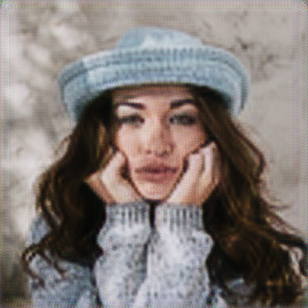
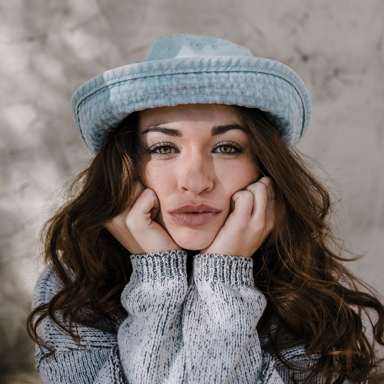
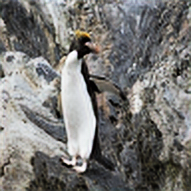
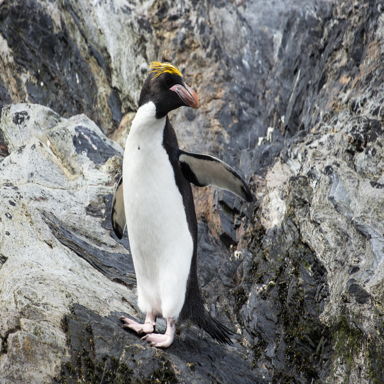
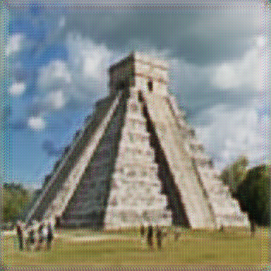
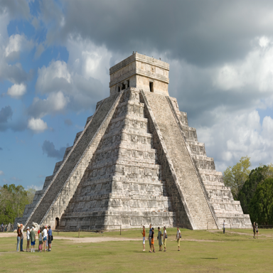

# GAN-Image-Super-Resolution

#### End-to-End *Keras implementation on top of Tensorflow 2.3*
* Part of a **[Biometric-Backdoors](https://github.com/Adk2001tech/Biometric-Backdoors)** research project.
* **Image Super-Resolution Using a Generative Adversarial Network** (**SR-GAN**)

### SR-GAN Architecture

### Train on your own Data

 Fork the repository.
 
 
 Dump the HR(**High-Resolution**) images under `Data/HR/` and LR(**Low-Resolution**) images under `Data/LR/`.
 
Make sure about 
        
        HR Images (Totall sample, 96*4, 96*4, 3)
        LR Images (Totall sample, 96, 96, 3)
        
Change `tot_sample=Totall sample in traning data` and  Run the following code in current directory for TRANING.
        
        python train.py

Model will get saved in `checkpoint` folder in running EPOCHS.

### Results
* Note:
   1. LRI- Low Resolution Input (96x96x3)
   2. HRP- High Resolution Prediction (384x384x3)
   3. RHR- Reference High Resolution Image(384x384x3)
* Results obtained with `batch_size=5`, `Traning sample= 100` and `Epoch=200`
   
   
-------------  **LRI**--------------------------- **HRP** ------------------------ **RHR** --------------

   

 

   

 

    

### Data
* Download data from [DIV2K - bicubic downscaling x4 competition](http://www.vision.ee.ethz.ch/ntire17/) dataset.
* Other direct links:  [test\_LR\_bicubic_X4](https://data.vision.ee.ethz.ch/cvl/DIV2K/validation_release/DIV2K_test_LR_bicubic_X4.zip), [train_HR](https://data.vision.ee.ethz.ch/cvl/DIV2K/DIV2K_train_HR.zip), [train\_LR\_bicubic_X4](https://data.vision.ee.ethz.ch/cvl/DIV2K/DIV2K_train_LR_bicubic_X4.zip), [valid_HR](https://data.vision.ee.ethz.ch/cvl/DIV2K/validation_release/DIV2K_valid_HR.zip), [valid\_LR\_bicubic_X4](https://data.vision.ee.ethz.ch/cvl/DIV2K/DIV2K_valid_LR_bicubic_X4.zip).

### References
1. **SR-GAN**- https://github.com/tensorlayer/srgan
2. **Photo-Realistic Single Image Super-Resolution Using a Generative Adversarial Network**- https://arxiv.org/pdf/1609.04802.pdf
3. **SUPER-RESOLUTION WITH DEEP CONVOLUTIONAL SUFFICIENT STATISTICS**- https://arxiv.org/pdf/1511.05666.pdf
